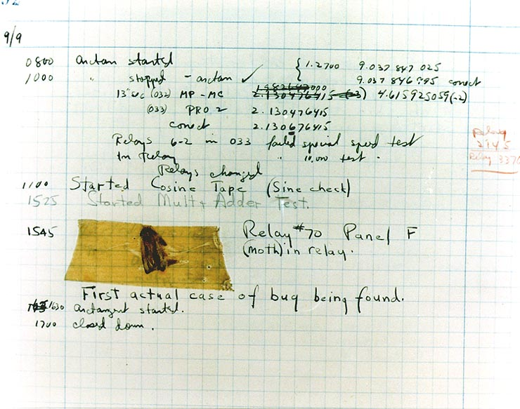

:title: Introduction to Debugging in Python
:author: Craig Maloney
:css: presentation.css

.. title:: Introduction to Debugging in Python

----

Introduction to Debugging in Python
===================================

* Author: Craig Maloney
* Email: craig@decafbad.net
* Website: http://decafbad.nety
* Presented: 2017-04-11

----

Programming is hard
===================

----

Programming leads to bugs
=========================

----

.. image:: images/Commodore_Grace_M._Hopper,_USN_(covered).jpg
    :width: 600px

.. note::

    Grace Brewster Murray Hopper, credited with the first literal computer bug, found in the Mark II computer.

----

.. note::

    While she was working on a Mark II Computer at a US Navy research lab in Dahlgren, Virginia in 1947, her associates discovered a moth stuck in a relay impeding its operation. While neither Hopper nor her crew mentioned the phrase "debugging" in their logs, the case was held as an instance of literal "debugging", perhaps the first in history. The term bug had been in use for many years in engineering.[60][61] The remains of the moth can be found in the group's log book at the Smithsonian Institution's National Museum of American History in Washington, D.C.[62]

----

Not all bugs are as obvious
===========================

----

Debugging is not just about fixing bugs...
==========================================

----

Debugging is about matching our expectations of what the code should be doing with the reality of what the computer is executing.

----

What does this code do?
=======================

----

.. code:: python 

    # Example 1
    def main():

        # Obviously bad code follows
        for i in range(1, 20):
            i /= 4

        if i == 20:
            print("Completed")

    if __name__ == "__main__":
        main()

----

Let's execute it and see what this does
=======================================

----

::

    craig@lister:~/projects/intro_debugging_python$ env/bin/python3 example1.py 
    craig@lister:~/projects/intro_debugging_python$ 

----

.. image:: images/2017-04-06-192152.jpg

----

So, what happened?
==================

----

.. code:: python 

    # Example 1
    def main():

        # Obviously bad code follows
        for i in range(1, 20):
            i /= 4

        if i == 20:
            print("Completed")

    if __name__ == "__main__":
        main()

When we run this nothing is displayed.

----

The lowly ``print()`` statement
===============================

----

.. code:: python

    # Example 2
    def main():

        # Obviously bad code follows
        for i in range(1, 20):
            i /= 4
            print(i)

        if i == 20:
            print("Completed")

    if __name__ == "__main__":
        main()

----

::

    craig@lister:~/projects/intro_debugging_python$ python3 example2.py 
    0.25
    0.5
    0.75
    1.0
    1.25
    1.5
    1.75
    2.0
    2.25
    2.5
    2.75
    3.0
    3.25
    3.5
    3.75
    4.0
    4.25
    4.5
    4.75

Now we can see what's happening with the ``i`` variable.

----

What we learned...
==================

* ``print(i)`` shows us the value inside of ``i``
* ``i`` is reset each iteration by the ``range(1, 20)`` generator.
* ``i`` will never be equal to ``20`` in this program, so we have dead code.

----

Switching over to logging...
============================

----

.. code:: python

    import logging

    # Example 3
    def main():

        logging.basicConfig(filename='example.log', level=logging.DEBUG)

        # Obviously bad code follows
        logging.debug("Beginning Loop")
        for i in range(1, 20):
            i /= 4
            logging.debug(i)
        logging.debug("End Loop")

        if i == 20:
            print("Completed")
            logging.debug("Completed")

        logging.debug("End program")

    if __name__ == "__main__":
        main() 

----

We're back to
=============

"silent running"...
===================

----

But now we have a log file of the results...
============================================

----

example.log:
::

    DEBUG:root:Beginning Loop
    DEBUG:root:0.25
    DEBUG:root:0.5
    DEBUG:root:0.75
    DEBUG:root:1.0
    DEBUG:root:1.25
    DEBUG:root:1.5
    DEBUG:root:1.75
    DEBUG:root:2.0
    DEBUG:root:2.25
    DEBUG:root:2.5
    DEBUG:root:2.75
    DEBUG:root:3.0
    DEBUG:root:3.25
    DEBUG:root:3.5
    DEBUG:root:3.75
    DEBUG:root:4.0
    DEBUG:root:4.25
    DEBUG:root:4.5
    DEBUG:root:4.75
    DEBUG:root:End Loop
    DEBUG:root:End program

----

So, what does this get us?
==========================

----

Using logging gives us the ability to:

* Turn debugging messages off and on again
* Not have to modify all of our code to turn debug messages on or off
* Filter which messages are logged and which are silently ignored

----

.. code:: python

    import logging

    # Example 4
    def main():

        logging.basicConfig(level=logging.INFO)

        logging.info("Beginning program")

        # Obviously bad code follows
        logging.debug("Beginning Loop")
        for i in range(1, 20):
            i /= 4
            logging.debug(i)
        logging.debug("End Loop")

        if i == 20:
            print("Completed")
            logging.debug("Completed")

        logging.info("End program")

    if __name__ == "__main__":
        main()

----

::

    craig@lister:~/projects/intro_debugging_python$ python example4.py
    INFO:root:Beginning program
    INFO:root:End program

----

::

    craig@lister:~/projects/intro_debugging_python$ git diff example4.py
    diff --git a/example4.py b/example4.py
    index 8b75c70..08824ee 100644
    --- a/example4.py
    +++ b/example4.py
    @@ -4,7 +4,7 @@ import logging
    # Example 4
    def main():
    
    -    logging.basicConfig(level=logging.INFO)
    +    logging.basicConfig(level=logging.DEBUG)
    
        logging.info("Beginning program")

----

::

    craig@lister:~/projects/intro_debugging_python$ python3 example4.py 
    INFO:root:Beginning program
    DEBUG:root:Beginning Loop
    DEBUG:root:0.25
    DEBUG:root:0.5
    DEBUG:root:0.75
    DEBUG:root:1.0
    DEBUG:root:1.25
    DEBUG:root:1.5
    DEBUG:root:1.75
    DEBUG:root:2.0
    DEBUG:root:2.25
    DEBUG:root:2.5
    DEBUG:root:2.75
    DEBUG:root:3.0
    DEBUG:root:3.25
    DEBUG:root:3.5
    DEBUG:root:3.75
    DEBUG:root:4.0
    DEBUG:root:4.25
    DEBUG:root:4.5
    DEBUG:root:4.75
    DEBUG:root:End Loop
    INFO:root:End program

----

So our debugging messages can be turned on and off at will
==========================================================

----

Let's try another example...
============================

----

.. code:: python

    # sum_of_numbers.py
    def main():
        list_of_numbers = []
        with open("list_of_numbers", 'rt') as f:
            for number in f:
                list_of_numbers.append(number)

        print("The sum is {total}".format(total=sum(list_of_numbers)))

    if __name__ == "__main__":
        main()

----

Running the code...
===================

----

::

    craig@lister:~/projects/intro_debugging_python$ env/bin/python3 sum_of_numbers.py 
    Traceback (most recent call last):
    File "sum_of_numbers.py", line 11, in <module>
        main()
    File "sum_of_numbers.py", line 8, in main
        print("The sum is {total}".format(total=sum(list_of_numbers)))
    TypeError: unsupported operand type(s) for +: 'int' and 'str'

----

So, what happened?
==================

----

Sure we could log or print the data, but...
===========================================

----

::

    craig@lister:~/projects/intro_debugging_python$ wc -l list_of_numbers 
    2000001 list_of_numbers

That's two million and one records.
    
----

That's a LOT of data to wade through...
=======================================

----

One approach...
===============

----

.. code:: python

    # sum_of_numbers.py
    def main():
        list_of_numbers = []
        with open("list_of_numbers", 'rt') as f:
            for number in f:
                list_of_numbers.append(number)

        # Print out the first element for debugging
        print(list_of_numbers[0])

        print("The sum is {total}".format(total=sum(list_of_numbers)))

    if __name__ == "__main__":
        main()

----

::

    craig@lister:~/projects/intro_debugging_python$ env/bin/python3 sum_of_numbers.py 
    24601

    Traceback (most recent call last):
    File "sum_of_numbers.py", line 13, in <module>
        main()
    File "sum_of_numbers.py", line 10, in main
        print("The sum is {total}".format(total=sum(list_of_numbers)))
    TypeError: unsupported operand type(s) for +: 'int' and 'str'

----

So, that sort of worked?
========================

----

.. code:: python

    # sum_of_numbers.py
    def main():
        list_of_numbers = []
        with open("list_of_numbers", 'rt') as f:
            for number in f:
                list_of_numbers.append(number)

        # Print out debugging information for first element
        print(list_of_numbers[0])
        print(type(list_of_numbers[0]))

        print("The sum is {total}".format(total=sum(list_of_numbers)))

    if __name__ == "__main__":
        main()

----

::

    craig@lister:~/projects/intro_debugging_python$ env/bin/python3 sum_of_numbers.py 
    24601

    <class 'str'>
    Traceback (most recent call last):
    File "sum_of_numbers.py", line 14, in <module>
        main()
    File "sum_of_numbers.py", line 11, in main
        print("The sum is {total}".format(total=sum(list_of_numbers)))
    TypeError: unsupported operand type(s) for +: 'int' and 'str'

----

``print()`` is a blunt instrument 
=================================

----

Even logging isn't of much help:

.. code:: python

    # sum_of_numbers.py
    import logging

    def main():
        logging.basicConfig(level=logging.DEBUG)

        list_of_numbers = []
        with open("list_of_numbers", 'rt') as f:
            for number in f:
                list_of_numbers.append(number)

        # Print out debugging information for first element
        logging.debug(list_of_numbers[0])
        logging.debug(type(list_of_numbers[0]))

        print("The sum is {total}".format(total=sum(list_of_numbers)))

    if __name__ == "__main__":
        main()

----

::

    craig@lister:~/projects/intro_debugging_python$ env/bin/python3 sum_of_numbers.py 
    DEBUG:root:24601

    DEBUG:root:<class 'str'>
    Traceback (most recent call last):
    File "sum_of_numbers.py", line 19, in <module>
        main()
    File "sum_of_numbers.py", line 16, in main
        print("The sum is {total}".format(total=sum(list_of_numbers)))
    TypeError: unsupported operand type(s) for +: 'int' and 'str'
    craig@lister:~/projects/intro_debugging_python$ 

----

Enter the debugger
==================

----

::

    craig@lister:~/projects/intro_debugging_python$ env/bin/python -m pdb sum_of_numbers.py 
    > /home/craig/projects/intro_debugging_python/sum_of_numbers.py(4)<module>()
    -> def main():
    (Pdb) b 11
    Breakpoint 1 at /home/craig/projects/intro_debugging_python/sum_of_numbers.py:11
    (Pdb) l
    1  	# sum_of_numbers.py
    2  	
    3  	
    4  ->	def main():
    5  	
    6  	    list_of_numbers = []
    7  	    with open("list_of_numbers", 'rt') as f:
    8  	        for number in f:
    9  	            list_of_numbers.append(number)
    10  	
    11 B	    print("The sum is {total}".format(total=sum(list_of_numbers)))
    (Pdb) c
    > /home/craig/projects/intro_debugging_python/sum_of_numbers.py(11)main()
    -> print("The sum is {total}".format(total=sum(list_of_numbers)))
    (Pdb) 

----

::

    craig@lister:~/projects/intro_debugging_python$ env/bin/python -m pdb sum_of_numbers.py 
    > /home/craig/projects/intro_debugging_python/sum_of_numbers.py(4)<module>()
    -> def main():
    (Pdb) b 11
    Breakpoint 1 at /home/craig/projects/intro_debugging_python/sum_of_numbers.py:11
    (Pdb) l
    1  	# sum_of_numbers.py
    2  	
    3  	
    4  ->	def main():
    5  	
    6  	    list_of_numbers = []
    7  	    with open("list_of_numbers", 'rt') as f:
    8  	        for number in f:
    9  	            list_of_numbers.append(number)
    10  	
    11 B	    print("The sum is {total}".format(total=sum(list_of_numbers)))
    (Pdb) c
    > /home/craig/projects/intro_debugging_python/sum_of_numbers.py(11)main()
    -> print("The sum is {total}".format(total=sum(list_of_numbers)))
    (Pdb) p list_of_numbers[0]
    '24601\n'
    (Pdb) 

----

Cheatsheet
==========

https://github.com/nblock/pdb-cheatsheet

----

.. image:: images/pdb-cheatsheet.png
    :width: 1200px

----

Invoking the Debugger
=====================

----

* ``python -m pdb`` *filename.py*

* *In the sourcecode itself:*

  * ``import pdb;pdb.set_trace()``

----

.. code:: python

    # sum_of_numbers.py

    def main():

        list_of_numbers = []
        with open("list_of_numbers", 'rt') as f:
            for number in f:
                list_of_numbers.append(number)

        # Start the debugger here
        import pdb
        pdb.set_trace()

        print("The sum is {total}".format(total=sum(list_of_numbers)))

    if __name__ == "__main__":
        main()

----

::

    craig@lister:~/projects/intro_debugging_python$ env/bin/python3 sum_of_numbers.py 
    > /home/craig/projects/intro_debugging_python/sum_of_numbers.py(14)main()
    -> print("The sum is {total}".format(total=sum(list_of_numbers)))
    (Pdb) 

----

OK, back to debugging the code...
=================================

----

.. code:: python

    # sum_of_numbers.py

    def main():

        import pdb
        pdb.set_trace()

        list_of_numbers = []
        with open("list_of_numbers", 'rt') as f:
            for number in f:
                # Convert input to an integer
                list_of_numbers.append(int(number))

        print("The sum is {total}".format(total=sum(list_of_numbers)))

    if __name__ == "__main__":
        main()

We convert ``number`` to an integer...

----

::

    craig@lister:~/projects/intro_debugging_python$ env/bin/python3 integer_sum_of_numbers.py 
    > /home/craig/projects/intro_debugging_python/integer_sum_of_numbers.py(9)main()
    -> list_of_numbers = []
    (Pdb) c
    Traceback (most recent call last):
    File "integer_sum_of_numbers.py", line 18, in <module>
        main()
    File "integer_sum_of_numbers.py", line 9, in main
        list_of_numbers = []
    ValueError: invalid literal for int() with base 10: 'Bob\n'

----

What the @#$%?!
===============

----

Conditional Breakpoint
======================

----

::

    (Pdb) b 13, number == 'Bob\n'
    Breakpoint 1 at /home/craig/projects/intro_debugging_python/integer_sum_of_numbers.py:13
    (Pdb) c
    > /home/craig/projects/intro_debugging_python/integer_sum_of_numbers.py(13)main()
    -> list_of_numbers.append(int(number))
    (Pdb) p number
    'Bob\n'
    (Pdb) l
    8  	
    9  	    list_of_numbers = []
    10  	    with open("list_of_numbers", 'rt') as f:
    11  	        for number in f:
    12  	            # Convert input to an integer
    13 B->	            list_of_numbers.append(int(number))
    14  	
    15  	    print("The sum is {total}".format(total=sum(list_of_numbers)))
    16  	
    17  	if __name__ == "__main__":
    18  	    main()
    (Pdb) 

----

Someone left a stray "Bob" in the data
======================================

----

(Dammit Bob, get out of the data)

----

So, how do we work around this?
===============================

----

One approach...
===============

----

.. code:: python

    # sum_of_numbers.py

    def main():

        import pdb
        pdb.set_trace()

        list_of_numbers = []
        with open("list_of_numbers", 'rt') as f:
            for number in f:
                try:
                    # Convert input to an integer
                    list_of_numbers.append(int(number))
                except ValueError:
                    pass

        print("The sum is {total}".format(total=sum(list_of_numbers)))

    if __name__ == "__main__":
        main()

----

::

    craig@lister:~/projects/intro_debugging_python$ env/bin/python3 integer_sum_of_numbers.py 
    > /home/craig/projects/intro_debugging_python/integer_sum_of_numbers.py(9)main()
    -> list_of_numbers = []
    (Pdb) c
    The sum is 30009298902

----

Let's do one better...
======================

----

.. code:: python

    # sum_of_numbers.py

    import logging

    def main():

        logging.basicConfig(level=logging.INFO)
        list_of_numbers = []
        with open("list_of_numbers", 'rt') as f:
            for number in f:
                try:
                    # Convert input to an integer
                    list_of_numbers.append(int(number))
                except ValueError:
                    logging.warning("Received non-integer input")
                    logging.warning(number)

        print("The sum is {total}".format(total=sum(list_of_numbers)))

    if __name__ == "__main__":
        main()

----

::

    craig@lister:~/projects/intro_debugging_python$ env/bin/python3 integer_sum_of_numbers.py 
    WARNING:root:Received non-integer input
    WARNING:root:Bob

    The sum is 30009298902

----

Now we're logging a warning whenever we get non-integer data
============================================================

----

(Thanks a lot, Bob)

----

So, what have we learned?
=========================

----

What we've learned:

* We can invoke the Python Debugger on our code

  * ``python3 -m pdb`` *filename.py*
  * ``import pdb;pdb.set_trace()``

* We can set breakpoints in our code
* We can use conditionals for breakpoints

----

Let's look more at debugging real computer code...
==================================================

----

.. code:: python

    def fib(n):
        if n == 1:
            return 1
        elif n == 0:
            return 0
        else:
            return fib(n-1) + fib(n-2)

    def main():
        print(fib(10))

    if __name__ == '__main__':
        main()

----

Let's see what this code does...

----

::

    craig@bluemidget:~/projects/intro_debugging_python$ python3 -m pdb fib.py 
    > /home/craig/projects/intro_debugging_python/fib.py(1)<module>()
    -> def fib(n):
    (Pdb) b 7
    Breakpoint 1 at /home/craig/projects/intro_debugging_python/fib.py:7
    (Pdb) ll
    1  -> def fib(n):
    2         if n == 1:
    3             return 1
    4         elif n == 0:
    5             return 0
    6         else:
    7 B           return fib(n-1) + fib(n-2)
    8     
    9     
    10     def main():
    11         print(fib(10))
    12     
    13     
    14     if __name__ == '__main__':
    15         main()

----

Repetitious commands around breakpoints...
==========================================

----

Wouldn't it be nice to see the call stack and the current arguments of the current method call?

::

    (Pdb) commands 1
    (com) bt
    (com) args
    (com) end
    (Pdb)

----

::

    (Pdb) b 5
    Breakpoint 2 at /home/craig/projects/intro_debugging_python/fib.py:5
    (Pdb) commands 2
    (com) bt
    (com) end
    (Pdb) b 3
    Breakpoint 3 at /home/craig/projects/intro_debugging_python/fib.py:3
    (Pdb) commands 3
    (com) bt
    (com) end
    
----

::

    (Pdb) ll
    1  ->	def fib(n):
    2  	    if n == 1:
    3 B	        return 1
    4  	    elif n == 0:
    5 B	        return 0
    6  	    else:
    7 B	        return fib(n-1) + fib(n-2)
    8  	
    9  	
    10  	def main():
    11  	    print(fib(10))
    12  	
    13  	
    14  	if __name__ == '__main__':
    15  	    main()

----

::

    (Pdb) b
    Num Type         Disp Enb   Where
    1   breakpoint   keep yes   at /home/craig/projects/intro_debugging_python/fib.py:7
    2   breakpoint   keep yes   at /home/craig/projects/intro_debugging_python/fib.py:3
    3   breakpoint   keep yes   at /home/craig/projects/intro_debugging_python/fib.py:5

----

::

    (Pdb) c
    /usr/lib/python3.4/bdb.py(431)run()
    -> exec(cmd, globals, locals)
    <string>(1)<module>()
    /home/craig/projects/intro_debugging_python/fib.py(15)<module>()
    -> main()
    /home/craig/projects/intro_debugging_python/fib.py(11)main()
    -> print(fib(10))
    > /home/craig/projects/intro_debugging_python/fib.py(7)fib()
    -> return fib(n-1) + fib(n-2)
    n = 10
    > /home/craig/projects/intro_debugging_python/fib.py(7)fib()
    -> return fib(n-1) + fib(n-2)
    (Pdb) l
    2  	    if n == 1:
    3  	        return 1
    4  	    elif n == 0:
    5  	        return 0
    6  	    else:
    7 B->	        return fib(n-1) + fib(n-2)
    8  	
    9  	
    10  	def main():
    11  	    print(fib(10))
    12  	

----

Time passes...
==============

----

::

    (Pdb) c
    /usr/lib/python3.4/bdb.py(431)run()
    -> exec(cmd, globals, locals)
    <string>(1)<module>()
    /home/craig/projects/intro_debugging_python/fib.py(15)<module>()
    -> main()
    /home/craig/projects/intro_debugging_python/fib.py(11)main()
    -> print(fib(10))
    /home/craig/projects/intro_debugging_python/fib.py(7)fib()
    -> return fib(n-1) + fib(n-2)
    ...
    -> return fib(n-1) + fib(n-2)
    > /home/craig/projects/intro_debugging_python/fib.py(7)fib()
    -> return fib(n-1) + fib(n-2)
    n = 2
    > /home/craig/projects/intro_debugging_python/fib.py(7)fib()
    -> return fib(n-1) + fib(n-2)
    (Pdb) c

----

::

    (Pdb) c
    /usr/lib/python3.4/bdb.py(431)run()
    -> exec(cmd, globals, locals)
    <string>(1)<module>()
    /home/craig/projects/intro_debugging_python/fib.py(15)<module>()
    -> main()
    /home/craig/projects/intro_debugging_python/fib.py(11)main()
    -> print(fib(10))
    /home/craig/projects/intro_debugging_python/fib.py(7)fib()
    -> return fib(n-1) + fib(n-2)
    ...
     /home/craig/projects/intro_debugging_python/fib.py(7)fib()
    -> return fib(n-1) + fib(n-2)
    > /home/craig/projects/intro_debugging_python/fib.py(3)fib()
    -> return 1
    > /home/craig/projects/intro_debugging_python/fib.py(3)fib()
    -> return 1

----

::

    (Pdb) c
    /usr/lib/python3.4/bdb.py(431)run()
    -> exec(cmd, globals, locals)
    <string>(1)<module>()
    /home/craig/projects/intro_debugging_python/fib.py(15)<module>()
    -> main()
    /home/craig/projects/intro_debugging_python/fib.py(11)main()
    -> print(fib(10))
    /home/craig/projects/intro_debugging_python/fib.py(7)fib()
    -> return fib(n-1) + fib(n-2)
    ...
    /home/craig/projects/intro_debugging_python/fib.py(7)fib()
    -> return fib(n-1) + fib(n-2)
    > /home/craig/projects/intro_debugging_python/fib.py(5)fib()
    -> return 0
    > /home/craig/projects/intro_debugging_python/fib.py(5)fib()
    -> return 0

----

Demo...
=======

----

What we learned...
==================

----

What we learned...

* Breakpoints can have commands associated with them using ``commands`` *<breakpoint number>*
* ``args`` displays the arguments passed to the method
* ``bt`` and ``where`` show the stack trace
* ``c`` continues after reaching a break point
* ``u`` and ``d`` move up and down the stack (demo)

----

A few more commands...
======================

----

.. code:: python

    def pointless_loop(n):

        number_sum = 0
        # This is a pointless loop
        for i in range(1, n+1):
            number_sum += i

    def main():
        pointless_loop(30)

    if __name__ == '__main__':
        main()

----

Conditional breakpoint...
=========================

----

``b`` *<linenum>* ``,`` *<condition>*

``b 6, number_sum > 100``

----

::

    craig@bluemidget:~/projects/intro_debugging_python$ python3 -m pdb pointless_loop.py 
    > /home/craig/projects/intro_debugging_python/pointless_loop.py(1)<module>()
    -> def pointless_loop(n):
    (Pdb) ll
    1  ->	def pointless_loop(n):
    2  	
    3  	    number_sum = 0
    4  	    # This is a pointless loop
    5  	    for i in range(1, n+1):
    6  	        number_sum += i
    ...
    (Pdb) b 6, number_sum > 100
    Breakpoint 1 at /home/craig/projects/intro_debugging_python/pointless_loop.py:6
    (Pdb) commands 1
    (com) pp i
    (com) pp number_sum
    (com) end
    (Pdb) c
    15
    105
    > /home/craig/projects/intro_debugging_python/pointless_loop.py(6)pointless_loop()
    -> number_sum += i

----

::

    > /home/craig/projects/intro_debugging_python/pointless_loop.py(6)pointless_loop()
    -> number_sum += i
    (Pdb) c
    16
    120
    > /home/craig/projects/intro_debugging_python/pointless_loop.py(6)pointless_loop()
    -> number_sum += i
    (Pdb) c
    17
    136
    > /home/craig/projects/intro_debugging_python/pointless_loop.py(6)pointless_loop()
    -> number_sum += i
    (Pdb) b
    Num Type         Disp Enb   Where
    1   breakpoint   keep yes   at /home/craig/projects/intro_debugging_python/pointless_loop.py:6
        stop only if number_sum > 100
        breakpoint already hit 17 times

----

Disabling Breakpoints...
========================

----

``disable`` *<breakpoint number>*

``disable 1``

----

::

    > /home/craig/projects/intro_debugging_python/pointless_loop.py(6)pointless_loop()
    -> number_sum += i
    (Pdb) c
    22
    231
    > /home/craig/projects/intro_debugging_python/pointless_loop.py(6)pointless_loop()
    -> number_sum += i
    (Pdb) c
    23
    253
    > /home/craig/projects/intro_debugging_python/pointless_loop.py(6)pointless_loop()
    -> number_sum += i
    (Pdb) disable 1
    Disabled breakpoint 1 at /home/craig/projects/intro_debugging_python/pointless_loop.py:6
    (Pdb) b
    Num Type         Disp Enb   Where
    1   breakpoint   keep no    at /home/craig/projects/intro_debugging_python/pointless_loop.py:6
        stop only if number_sum > 100
        breakpoint already hit 23 times

----

Temporary Breakpoints...

----

::

    (Pdb) tbreak 6, number_sum > 100
    Breakpoint 1 at /home/craig/projects/intro_debugging_python/pointless_loop.py:6
    (Pdb) l
    1  ->	def pointless_loop(n):
    2  	
    3  	    number_sum = 0
    4  	    # This is a pointless loop
    5  	    for i in range(1, n+1):
    6 B	        number_sum += i
    ...
    (Pdb) b
    Num Type         Disp Enb   Where
    1   breakpoint   del  yes   at /home/craig/projects/intro_debugging_python/pointless_loop.py:6
        stop only if number_sum > 100
    (Pdb) c
    Deleted breakpoint 1 at /home/craig/projects/intro_debugging_python/pointless_loop.py:6
    > /home/craig/projects/intro_debugging_python/pointless_loop.py(6)pointless_loop()
    -> number_sum += i
    (Pdb) pp number_sum
    105
    (Pdb) b
    (Pdb) 

----

Python3 Debugging Goodies...
============================

----

Display
=======

----

::

    > /home/craig/projects/intro_debugging_python/pointless_loop.py(1)<module>()
    -> def pointless_loop(n):
    (Pdb) n
    > /home/craig/projects/intro_debugging_python/pointless_loop.py(9)<module>()
    -> def main():
    (Pdb) n
    > /home/craig/projects/intro_debugging_python/pointless_loop.py(12)<module>()
    -> if __name__ == '__main__':
    (Pdb) n
    > /home/craig/projects/intro_debugging_python/pointless_loop.py(13)<module>()
    -> main()
    (Pdb) s
    --Call--
    > /home/craig/projects/intro_debugging_python/pointless_loop.py(9)main()
    -> def main():
    (Pdb) n

----

 ::

    > /home/craig/projects/intro_debugging_python/pointless_loop.py(10)main()
    -> pointless_loop(30)
    (Pdb) s
    --Call--
    > /home/craig/projects/intro_debugging_python/pointless_loop.py(1)pointless_loop()
    -> def pointless_loop(n):
    (Pdb) display number_sum
    display number_sum: ** raised NameError: name 'number_sum' is not defined **
    (Pdb) n
    > /home/craig/projects/intro_debugging_python/pointless_loop.py(3)pointless_loop()
    -> number_sum = 0
    (Pdb) n
    > /home/craig/projects/intro_debugging_python/pointless_loop.py(5)pointless_loop()
    -> for i in range(1, n+1):
    display number_sum: 0  [old: ** raised NameError: name 'number_sum' is not defined **]
    (Pdb) 

----

::

    (Pdb) n
    > /home/craig/projects/intro_debugging_python/pointless_loop.py(6)pointless_loop()
    -> number_sum += i
    (Pdb) n
    > /home/craig/projects/intro_debugging_python/pointless_loop.py(5)pointless_loop()
    -> for i in range(1, n+1):
    display number_sum: 1  [old: 0]
    (Pdb) n
    > /home/craig/projects/intro_debugging_python/pointless_loop.py(6)pointless_loop()
    -> number_sum += i
    (Pdb) n
    > /home/craig/projects/intro_debugging_python/pointless_loop.py(5)pointless_loop()
    -> for i in range(1, n+1):
    display number_sum: 3  [old: 1]
    (Pdb) n
    > /home/craig/projects/intro_debugging_python/pointless_loop.py(6)pointless_loop()
    -> number_sum += i
    (Pdb) n
    > /home/craig/projects/intro_debugging_python/pointless_loop.py(5)pointless_loop()
    -> for i in range(1, n+1):
    display number_sum: 6  [old: 3]
    (Pdb) n
   
----

Pdb++
=====

https://pypi.python.org/pypi/pdbpp/

----

Demo...
=======
----

Helpful links...
================

----

Pdb Debugger:

* https://pymotw.com/3/pdb/
* https://github.com/nblock/pdb-cheatsheet
* https://docs.python.org/3/library/pdb.html

Logging:

* https://pymotw.com/3/logging/
* https://docs.python.org/3/library/logging.html

Pdb++:

* https://pypi.python.org/pypi/pdbpp/

----

Questions?
==========

-----

Thank you!
==========

----

Introduction to Debugging in Python
===================================

* Author: Craig Maloney
* Email: craig@decafbad.net
* Website: http://decafbad.nety
* Presented: 2017-04-11
